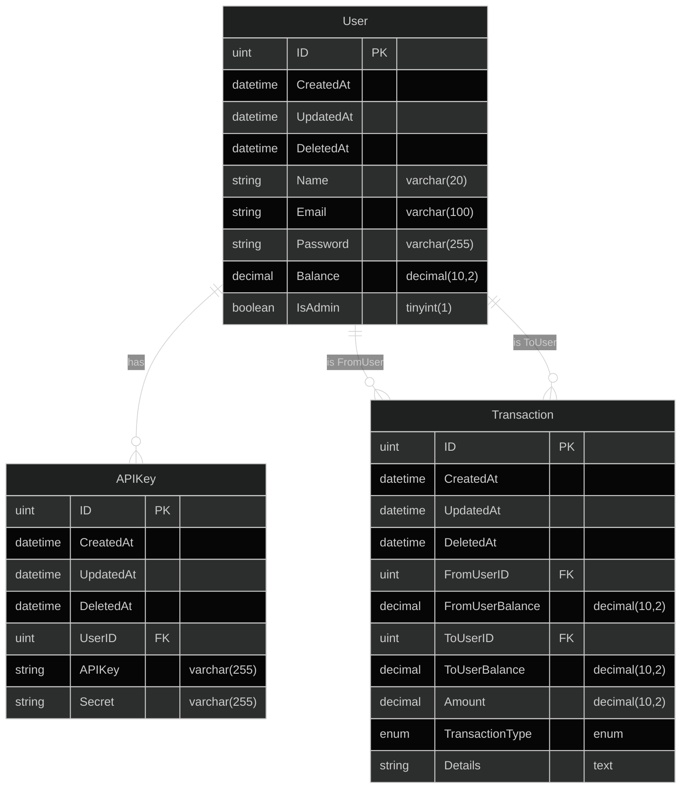

# Banking System
- [Banking System](#banking-system)
- [Project structure](#project-structure)
- [Clean Architecture](#clean-architecture)
    - [Architecture Diagram](#architecture-diagram)
- [Run the services](#run-the-services)
  - [Prepare yaml config.docker.yaml](#prepare-yaml-configdockeryaml)
  - [Start all services](#start-all-services)
  - [Stop all services](#stop-all-services)
- [Add New Restful api](#add-new-restful-api)
    - [Add new route](#add-new-route)
    - [Add new handler for user](#add-new-handler-for-user)
    - [Add new service for user](#add-new-service-for-user)
    - [Add new repo for user using mysql database](#add-new-repo-for-user-using-mysql-database)
- [Database ER Diagram](#database-er-diagram)
- [Test Data](#test-data)

# Project structure
```
banking/
├─ app/
│  ├─ api/
│  │  ├─ restful/
│  │  ├─-├─ v1/
│  │  │  |  ├─ handler/
│  │  │  │  |  ├─ user/
│  │  │  │  │  |  ├─ user.go
│  │  │  │  │  |  ├─ user_test.go
│  │  │  |  ├─ response.go
│  │  ├─ router.go
│  ├─ repo/
│  │  ├─ mysql/
│  │  │  ├─ transaction/
│  │  │  │  ├─ command.go
│  │  │  │  ├─ command_test.go
│  │  │  │  ├─ errorMsg.go
│  │  │  │  ├─ setup_mysql_test.go
│  │  │  ├─ user/
│  │  │  │  ├─ query.go
│  │  │  │  ├─ query_test.go
│  │  │  │  ├─ command.go
│  │  │  │  ├─ command_test.go
│  │  │  │  ├─ errorMsg.go
│  │  │  │  ├─ setup_mysql_test.go
│  ├─ service/
│  │  ├─ transaction/
│  │  │  ├─ transaction.go
│  │  ├─ user/
│  │  │  ├─ user.go
├─ build/
│  ├─ k6/
│  │  ├─ scripts/
│  │  │  ├─ get-users.js
│  │  ├─ .env
│  │  ├─ config.json
│  │  ├─ Dockerfile
│  │  ├─ README.md
│  ├─ mysql/
│  │  ├─ master/
│  │  │  ├─ master-init.sql
│  │  │  ├─ master.cnf
│  │  ├─ slave/
│  │  │  ├─ slave-init.sql
│  │  │  ├─ slave.cnf
│  ├─ prometheus/
│  │  ├─ prometheus.yml
│  ├─ docker-compose.yml
├─ cmd/
│  ├─ apiserver.go
│  ├─ root.go
├─ config/
│  ├─ config.example.yaml # remove .example to use
│  ├─ config.example.docker.yaml # remove .example to use
├─ database/
│  ├─ mysql/
│  │  ├─ mysql.go
│  │  ├─ wire_gen.go
│  │  ├─ wire.go
├─ docs/
│  ├─ docs.go
│  ├─ swagger.json
│  ├─ swagger.yaml
├─ domain/
|  ├─ mock/
│  |  ├─ transaction.go
│  |  ├─ user.go
│  ├─ transaction.go
│  ├─ user.go
├─ global/
│  ├─ global.go
├─ log/
│  ├─ logger.go
├─ model/
│  ├─ transaction.go
│  ├─ user.go
├─ .gitignore
├─ Dockerfile
├─ go.mod
├─ go.sum
├─ LICENSE
├─ main.go
├─ makefile
├─ README.md
```

# Clean Architecture
* This application is designed with Clean Architecture, including 5 layers:
    1. Handler: This layer is responsible for handling the request and response.
       * DTO: This is responsible for the data structure used in handler.
    2. Service: This layer is responsible for the business logic.
    3. Repository: This layer is responsible for the data access.
       * Model: This is responsible for the data structure used in data access.
    4. Domain: This layer is responsible for the interface used in handler, service, and repository.

### Architecture Diagram


# Run the services
* This project uses docker-compose to run all services, including:
    1. Banking service
    2. Redis
    3. MySQL
    4. Elasticsearch
    5. Kibana
    6. APM server

## Prepare yaml config.docker.yaml
```bash
cp config/config.example.docker.yaml config/config.docker.yaml
```

## Start all services
```bash
make docker_up
```

## Stop all services
```bash
make docker_down
```

# Add New Restful api
### Add new route
1. Add path in [app/api/router.go](app/api/router.go)

### Add new handler for user
1. Add handler in [app/api/v1/handler/user/user.go](app/api/v1/handler/user/user.go)
2. Add handler test in [app/api/v1/handler/user/user_test.go](app/api/v1/handler/user/user_test.go)

### Add new service for user
* The service of this demo project is quite simple, so we don't need to add service test, if more complex logic is needed, we should add service test.
1. Add service in [app/service/user/user.go](app/service/user/user.go)

### Add new repo for user using mysql database
* Query repo is used to get data from database
1. Add query repo in [app/repo/mysql/user/query.go](app/repo/mysql/user/query.go)
2. Add query repo test in [app/repo/mysql/user/query_test.go](app/repo/mysql/user/query_test.go)
* Command repo is used to insert, update, delete data from database
1. Add command repo in [app/repo/mysql/user/command.go](app/repo/mysql/user/command.go)
2. Add command repo test in [app/repo/mysql/user/command_test.go](app/repo/mysql/user/command_test.go)

# Database ER Diagram


# Test Data
```
Admin
    Name: user1
    Email: user1@yopmail.com
    Password: password

User
    Name: user2
    Email: user2@yopmail.com
    Password: password

    Name: user3
    Email: user3@yopmail.com
    Password: password
```